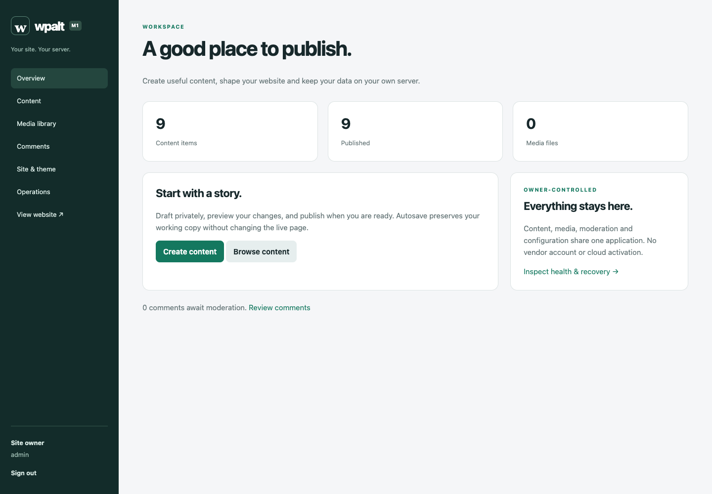

# wpalt

An owner-controlled Rust CMS with a bundled admin panel and public website. The composable publishing system includes multilingual discovery, integrated structured authoring M4 business/audience workflows M5 membership/learning and M6 commerce/reservations on SQLite or PostgreSQL, with no mandatory vendor account or external runtime services.

Create posts and pages, keep drafts separate from live content, autosave, preview, restore revisions and schedule publication. Manage images, typed fields, basic compositions, navigation, Paper/Ink themes, moderated comments and local search. Export content, download a consistent manual backup and recover into a fresh database, including across database engines.

Design and embed typed forms; protect responses/files; manage purpose-specific confirmed audiences; compose conditional, scheduled and confirmation-triggered messages with a local outbox or configured SMTP; approve subscriber accounts and moderate contributions. Measure explicitly consented events, bounded geometry-only interactions and local A/B offers. See [business operation and limits](docs/business.md) and [M4 delivery evidence](docs/evidence/m4-verification.md).

Manage locally assigned memberships, protected content/downloads, ordered courses, quizzes, assignments, grading, certificates, organizations, gifts and moderated communities. Optional configured OIDC sign-in is independent of local accounts. See [membership and learning operation/limits](docs/membership-learning.md) and [M5 verification status](docs/evidence/m5-verification.md); local commerce connects paid access to actually recorded settlement; hosted card processing is optional and external.



## Run

Rust 1.88 or newer is the declared build floor, verified by CI. Node/npm are frontend development tools; the resulting server requires no Cargo, Node or PHP at runtime.

```sh
npm ci --prefix frontend --ignore-scripts
npm --prefix frontend run build
cargo build --release --locked
cp wpalt.example.toml wpalt.local.toml
./target/release/wpalt --config wpalt.local.toml init --admin-email you@example.com
./target/release/wpalt --config wpalt.local.toml seed-demo
./target/release/wpalt --config wpalt.local.toml serve
```

Initialization reads the password from stdin. Use a private pipe/password manager; the first CLI does not mask interactive input. Visit the configured origin's `/login` (default `http://127.0.0.1:3000`). Review [operations and recovery](docs/operations.md) before exposing a site. Non-local deployments require an HTTPS origin behind a TLS reverse proxy.

Configuration follows CLI > supported environment variables > explicitly selected TOML > defaults. The admin panel controls site content/design. `wpalt config` reports validated, redacted infrastructure configuration.

[Automatic clean post-merge builds and downloads](docs/operations.md#automatic-clean-builds-after-merge) are documented in operations.

## Frontend quality foundation

The pre-M3 supporting work uses semantic tokens and native components, measured responsive geometry, accessibility checks and reviewed platform-specific visual baselines. [Design and verification contract](docs/frontend-foundations.md) explains how to extend it and review its screenshot/measurement reports. These developer tools add no Node requirement to the running server.

## Review the delivered systems

- [M6 commerce/reservation contract](docs/m6-contract.md), [operation and limits](docs/commerce-reservations.md), [connected journeys](tests/support/commerce_journeys.rs) and [verification](docs/evidence/m6-verification.md)
- [M5 membership/learning contract](docs/m5-contract.md), [operation and limits](docs/membership-learning.md), [connected acceptance journeys](tests/support/membership_journeys.rs) and [verification record](docs/evidence/m5-verification.md)

- [M3 multilingual discovery contract](docs/m3-contract.md), [publishing/discovery guide](docs/discovery.md) and [verification evidence](docs/evidence/m3-verification.md)

- [M2 builder contract](docs/m2-contract.md), [authoring guide](docs/theme-authoring.md) and [M2 evidence](docs/evidence/m2-verification.md)
- [M1 contract and deployment boundaries](docs/m1-contract.md)
- [Verification, performance, security and reference evidence](docs/evidence/m1-verification.md)
- [Readable acceptance journeys](tests/acceptance.rs), [real browser workflow](scripts/browser_acceptance.cjs), [CLI recovery journey](scripts/cli_acceptance.py)
- [Architecture decision](docs/decisions/0001-m1-architecture.md)

`cargo test --locked` always exercises SQLite. Set `TEST_DATABASE_URL` to an isolated PostgreSQL database to run both engines; CI requires it. Tests create/drop temporary PostgreSQL schemas. Use disposable databases, never production credentials.

## Project contract

- [Product goals](docs/wpalt-product-goals.md)
- [Development methodology](docs/wpalt-development-methodology.md)
- [Milestones](docs/wpalt-milestones.md)
- [132 researched capability groups and remaining milestone assignments](docs/feature-parity.json)
- [Current feature guidance](docs/evidence/feature-guidance.json) and [freshness gate](scripts/check_protocols.py)

M1–M8 are pre-adoption development. M2 provides typed models, parameterized reusable components, responsive templates, relational/repeater bindings, options and theme publication through a bundled studio. Full WordPress/plugin parity and multi-server operation remain later milestones. M1 operates one application process per site/data directory, with manual unencrypted backups and fresh-target restore. Licensing is not yet selected. No WordPress or plugin implementation code is incorporated.

The integrated writing milestone and its structured-document API/migration are documented in [authoring](docs/authoring.md). This remains a pre-adoption milestone build; full WordPress/plugin parity is the roadmap goal, not the current capability claim.

Development distribution and pipeline: [automatic releases and CI](docs/automatic-releases.md).

M7 is in development: [completion contract](docs/m7-contract.md) and [initial resilience controls](docs/resilient-operations.md). Earlier capabilities remain supported; the full M7 delivery is not yet verified.
